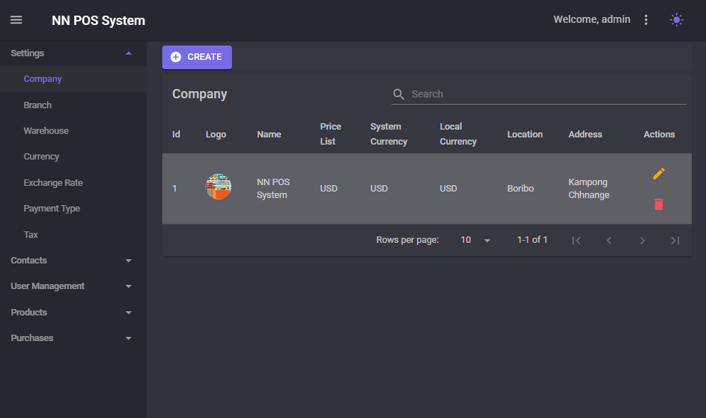
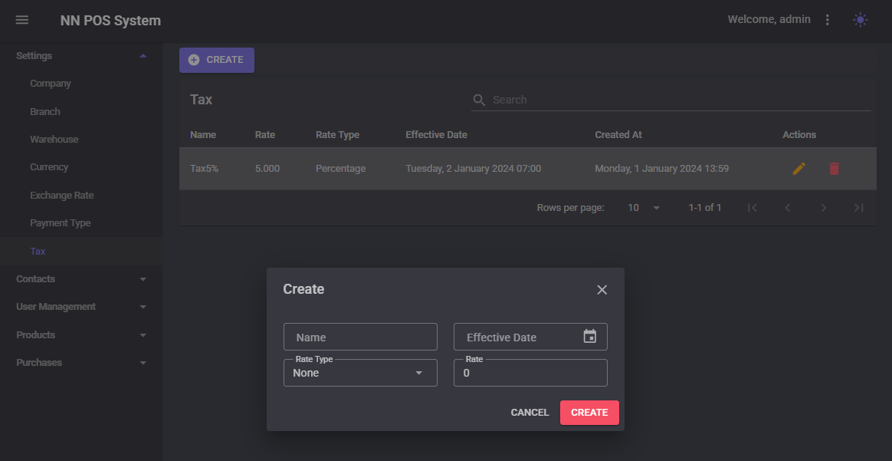
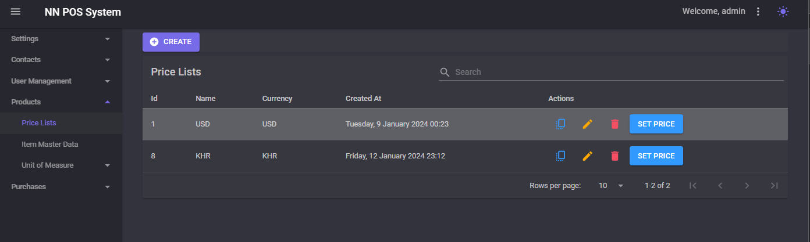

# NN.POS.System 

## Tech Stacks
- Backend
  - .NET(C#) [.NET Core](https://dotnet.microsoft.com/en-us/)
  - SQL Server for Database [MSSQL](https://www.microsoft.com/en-us/sql-server/sql-server-downloads)
  - Structure as a Clean Architecture (CQRS) with Mediator [MediatR](https://github.com/jbogard/MediatR)
  - Jwt as an authentication method [jwt.io](https://jwt.io/)
  - Nlog as a logging
- Web
  - Blazor Framework [Blazor](https://dotnet.microsoft.com/en-us/apps/aspnet/web-apps/blazor)
  - MudBlazor as Component UI [mudblazor.com](https://mudblazor.com/)

## Features

- Settings
  - Company
  - Branch
  - Warehouse
  - Currency
  - Exchange Rate
  - Payment Type
  - Tax
- Contacts
  - Suppliers
  - Customers
  - Customers Group
- User Management
  - Users
  - Roles
- Products
  - Price List
  - Items
  - Unit Of Measure
    - Uom
    - Uom Group
- Purchases
  - Purchase Order
  - Purchase PO
  - Purchase A/P
  - Purchase Credit Memo

## Details

- Settings
  - Company
    
    
  - Branch
    
    
  - Warehouse
    
  - Currency
    
  - Exchange Rate
    
  - Payment Type
    
  - Tax
    
- Contacts
  - Suppliers
    
    
  - Customers
    
    
  - Customers Group
    
    
- User Management
  - Users
    
    
  - Roles
    
    
- Products
  - Price List
    
  - Items
    
    
  - Unit Of Measure
    - Uom
      
    - Uom Group
      
- Purchases
  - Purchase Order
    
  - Purchase PO
  - Purchase A/P
  - Purchase Credit Memo